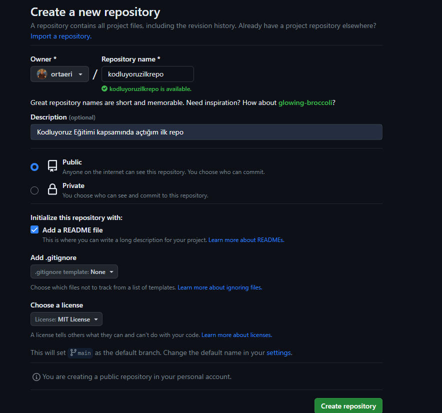

# Kodluyoruz İlk Repo
Kodluyoruz Eğitimi kapsamında açtığım ilk repo


## Installation
---
### Öncelikle projeyi clonelayın (Buraya sizn reponuzdan aldığınız kod gelecek)

```
git clone https://github.com/ortaeri/kodluyoruzilkrepo.git
```

## Usage
---
### Projeyi cloneladıktan sonra Visual Studio Code programını açın.

### Linux için:
```
cd kodluyoruzilkrepo
code .
```
## Contributing
---
### Pull requestler kabul edilir.Büyük değişiklikler için,lütfen önce neyi değiştirmek istediğinizi tartışmak için konu açınız.

## License
---
[MIT](https://choosealicense.com/licenses/mit/)
